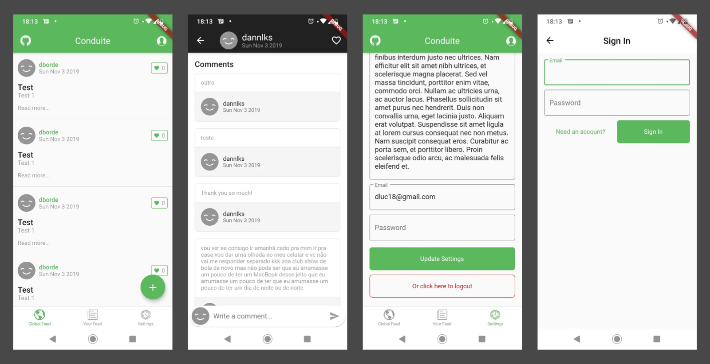

# 

> ### [Flutter](https://flutter.io/) codebase containing real world examples (CRUD, auth, advanced patterns, etc) that adheres to the [RealWorld](https://github.com/gothinkster/realworld) spec and API.

### [Demo](https://play.google.com/store/apps/details?id=dev.d92.conduite)&nbsp;&nbsp;&nbsp;&nbsp;[RealWorld](https://github.com/gothinkster/realworld)

This codebase was created to demonstrate a fully fledged fullstack application built with [Flutter](https://flutter.io/) including CRUD operations, authentication, routing, pagination, and more.

We've gone to great lengths to adhere to the [Flutter](https://flutter.io/) community styleguides & best practices.

For more information on how to this works with other frontends/backends, head over to the [RealWorld](https://github.com/gothinkster/realworld) repo.

# How it works

> Describe the general architecture of your app here

# Getting started

`flutter packages get`

`flutter run`

# Preview
# 
